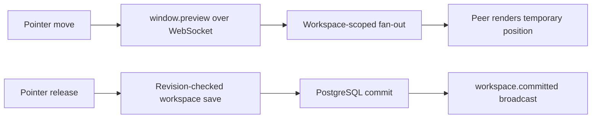
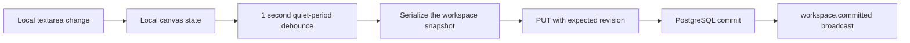

# Collaboration in Censai

Censai treats collaboration as a property of the workspace, not as a second chat panel. People and
agents act on the same canvas, but different kinds of state have different latency and durability
requirements.

## What the beta proves

The collaboration verifier exercises three authenticated actors: a workspace owner, an invited
member, and an outsider. The owner and member join one workspace while the outsider is rejected.
The verified path covers:

- email invitation of a separately registered member;
- workspace-scoped WebSocket authentication and presence;
- low-latency remote window-move previews;
- revision-checked PostgreSQL canvas commits;
- committed-state broadcast to all connected members;
- approval-gated agent edits to visible document and code windows;
- durable recovery after disconnect and server restart;
- workspace-isolated, bounded summaries of meaningful collaboration events.

This is evidence for that path. It is not a claim that every window is a simultaneous editor or that
the current in-memory WebSocket hub can fan out across multiple application servers.

## Why moving a window feels instant

Window movement uses an ephemeral preview channel:

The client sends at most one preview about every 32 milliseconds. Peers render that position without
mutating their durable workspace, then replace it with the authoritative committed position. A stale
preview expires automatically.

## Why typed words currently arrive later

Text editing follows the durable workspace path:

This keeps autosave bounded and makes conflicts visible, but it means another member sees text after
the typist pauses. Lowering the debounce alone is not the right fix: it would send more whole-workspace
writes and make simultaneous editors collide on the same revision more often.

## The route to synchronous text

There are two useful milestones.

### 1. Fast beta: live text preview with a soft edit lease

For a near-term demo-quality experience, add a bounded `text.preview` WebSocket event for document
and code fields:

- send coalesced updates every 40–80 ms;
- identify workspace, window, field, actor, sequence, and base revision on the server;
- cap payload size and allow only writable window fields;
- show the remote preview and collaborator label without treating it as durable state;
- give one client a short renewable edit lease, so two typists cannot silently overwrite each other;
- retain the existing revisioned save as the authority and recovery path.

This makes words appear quickly and is small enough for the current architecture. It is not true
multi-cursor co-editing.

### 2. Correct product: CRDT-backed text fields

For Google-Docs-style simultaneous editing, use a CRDT such as Yjs for each collaborative text field:

- one `Y.Text` document per workspace/window/field;
- WebSocket binary updates instead of whole text values;
- awareness messages for names, cursors, selections, and typing state;
- periodic compact snapshots plus a bounded update log in PostgreSQL;
- agent writes applied as attributed CRDT transactions through the same document;
- authorization, payload limits, and approval checks enforced before updates enter the shared doc;
- Redis or Postgres-backed pub/sub when the app runs on more than one server instance.

The canvas layout can keep its current preview-plus-revision design. CRDTs are valuable for the
small set of fields people truly edit concurrently; using them for every canvas property would add
complexity without improving the window-drag experience.

## Collaboration invariants

Any next step should preserve these rules:

1. A user must be an authorized workspace member before opening the collaboration socket.
2. Ephemeral previews never become the durable authority by themselves.
3. Durable changes have a server-derived actor and workspace identity.
4. Agent writes use the same shared state and remain subject to tool permissions and approval.
5. Reconnect recovers from durable state, not from another browser's memory.
6. One workspace must never receive another workspace's events.
7. A collaboration or memory side-effect failure must not corrupt the authoritative canvas.

## Current scaling boundary

The beta collaboration hub is in memory inside one application process. That is appropriate for the
current single-node self-hosted stack. Before horizontal scaling, presence and event fan-out need a
shared backplane, and reconnect behavior must be tested while clients land on different nodes.
