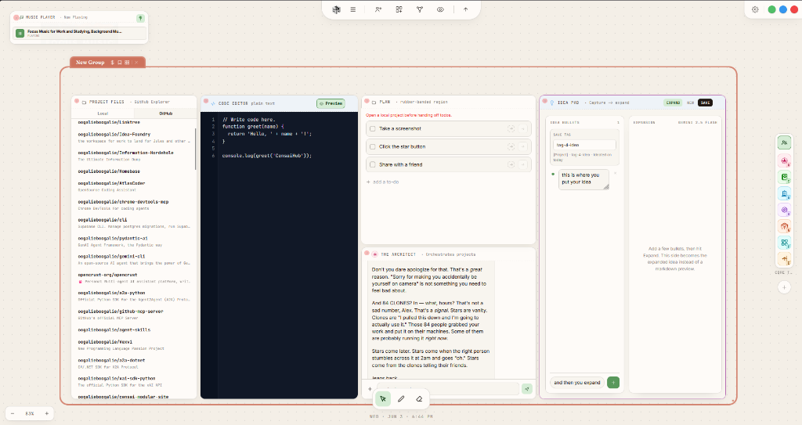

# 🌌 Censai

**The infinite canvas where your team and your AI agents work side by side — self-hosted, local-first, yours.**

<div align="left">

[](LICENSE)
[](https://github.com/oogalieboogalie/censai/actions/workflows/ci.yml)
[](https://www.docker.com)
[](https://github.com/oogalieboogalie/censai/stargazers)

</div>

Censai is named after the first agent its creator ever built — the one that taught him enough to start a company. The product carries the same idea: agents that persist, remember, and get better at working with you.

---

## The Product

Censai turns multi-agent work into a visual sandbox instead of a chat log. Drag windows across an infinite canvas, draw connections, group workers into stations, and watch your agents execute code, browse files, and write documents in real time.

It ships as a blank canvas — no pre-seeded branding, no opinionated structure. You design the personalities, connect the tools, and set the parameters.



---

## Key Features

### 🧠 Infinite Canvas UI
- **Visual sandbox**: drag, zoom, pan, and rubber-band select across a grid canvas.
- **Node-link architecture**: physically draw links to attach agents to tools or chat groups.
- **Smart container regions**: color-coded groups bind sets of agents together, with one-click tree-layout cleanup.

### 🕵️ Persistent Agents
- **Agent designer**: custom prompts, hues, glyphs, and per-agent tool registries.
- **Multi-provider LLM engine**: point agents at local models (Ollama) or cloud APIs (Gemini, OpenRouter, Moonshot, any OpenAI-compatible endpoint).
- **Real memory**: PostgreSQL-backed weighted memories, AES-encrypted private journals, a knowledge graph, and semantic recall via Qdrant (optional, degrades gracefully).
- **A family, not a fleet**: agents have emotional state, watch over each other, and heal each other's memory when context fills.

### 🛠️ Built-In Workspace Windows
38 window types, registered through a single manifest: code editor with live preview, local & GitHub file browsers, task scheduler, todos, docs with annotations, terminal, image generation, a music player, and more. Scaffold your own with `npm run window:new`.

### ⚙️ Background Workers
An agent task queue and a cron scheduler run server-side — agents keep working when the canvas is closed.

---

## ⚡ Quick Start

### 1. Clone the repo
```bash
git clone https://github.com/oogalieboogalie/censai.git
cd censai
```

### 2. Pull local models (optional)
With [Ollama](https://ollama.com/) installed, pull a tool-calling chat model and the default embedding model:
```bash
ollama pull qwen3-coder:latest
ollama pull nomic-embed-text
```

### 3. Create your local configuration
```bash
cp .env.example .env
```

### 4. Start the stack
```bash
docker compose -f docker-compose.yml -f docker-compose.ghcr.yml up -d
```
Open **http://localhost:3002** and start building.

That command pulls the validated public image from GitHub Container Registry. To build the
same release from its published source instead, run `docker compose up -d --build`.

Every merge to `main` that passes CI creates an immutable `selfhost-<date>-<commit>` GitHub
release and matching GHCR image. `latest` follows the newest validated release; the dated tag
is the reproducible choice for production installs.

---

## Configuration

Edit `.env` to add any cloud LLM or external-integration keys you choose to use. Local Ollama
does not require a paid API key.

See [SELF_HOSTING_GUIDE.md](SELF_HOSTING_GUIDE.md) for the full walkthrough and [ARCHITECTURE.md](ARCHITECTURE.md) for how the pieces fit together. Contributions: [CONTRIBUTING.md](CONTRIBUTING.md).

---

## ☁️ Censai Cloud

A managed cloud version — hosted, with teams and built-in AI credits — is in the works. Self-hosting stays free.

---

## 📜 License

[Business Source License 1.1](LICENSE). In plain English: run it locally or self-host it inside your organization for free, including for business use. What you can't do is offer Censai itself to third parties as a hosted or managed service. Each release converts to MIT four years after publication (this one: June 10, 2030).
